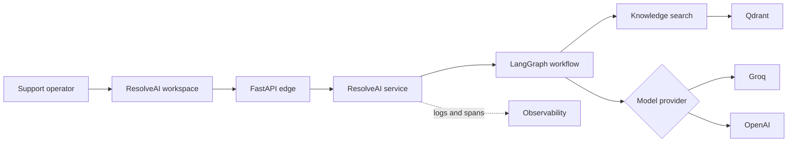
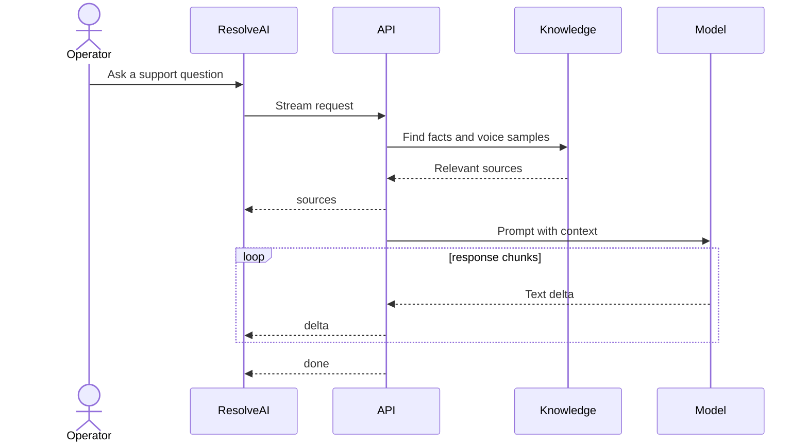
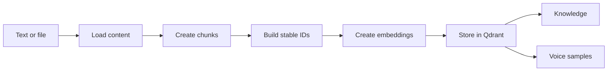
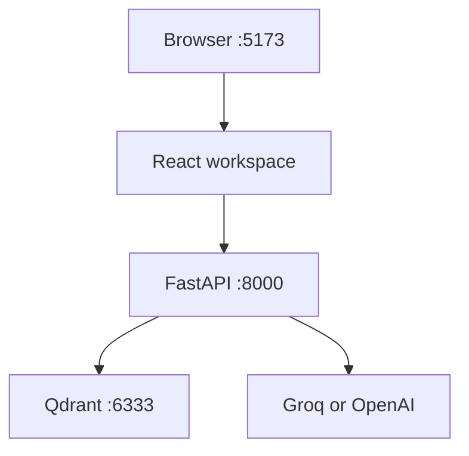

# ResolveAI Diagrams

## Platform

```mermaid
flowchart LR
    Operator["Support operator"] --> UI["ResolveAI workspace"]
    UI --> Edge["FastAPI edge"]
    Edge --> Service["ResolveAI service"]
    Service --> Graph["LangGraph workflow"]
    Graph --> Search["Knowledge search"]
    Search --> Qdrant["Qdrant"]
    Graph --> Model{"Model provider"}
    Model --> Groq["Groq"]
    Model --> OpenAI["OpenAI"]
    Service -. logs and spans .-> Telemetry["Observability"]
```

## Answer flow

```mermaid
sequenceDiagram
    actor Operator
    participant UI as ResolveAI
    participant API
    participant RAG as Knowledge
    participant LLM as Model

    Operator->>UI: Ask a support question
    UI->>API: Stream request
    API->>RAG: Find facts and voice samples
    RAG-->>API: Relevant sources
    API-->>UI: sources
    API->>LLM: Prompt with context
    loop response chunks
        LLM-->>API: Text delta
        API-->>UI: delta
    end
    API-->>UI: done
```

## Knowledge ingestion

```mermaid
flowchart LR
    Input["Text or file"] --> Load["Load content"]
    Load --> Split["Create chunks"]
    Split --> Hash["Build stable IDs"]
    Hash --> Embed["Create embeddings"]
    Embed --> Store["Store in Qdrant"]
    Store --> Facts["Knowledge"]
    Store --> Voice["Voice samples"]
```

## Local stack

```mermaid
flowchart TB
    Browser["Browser :5173"] --> Frontend["React workspace"]
    Frontend --> API["FastAPI :8000"]
    API --> Qdrant["Qdrant :6333"]
    API --> Provider["Groq or OpenAI"]
```
